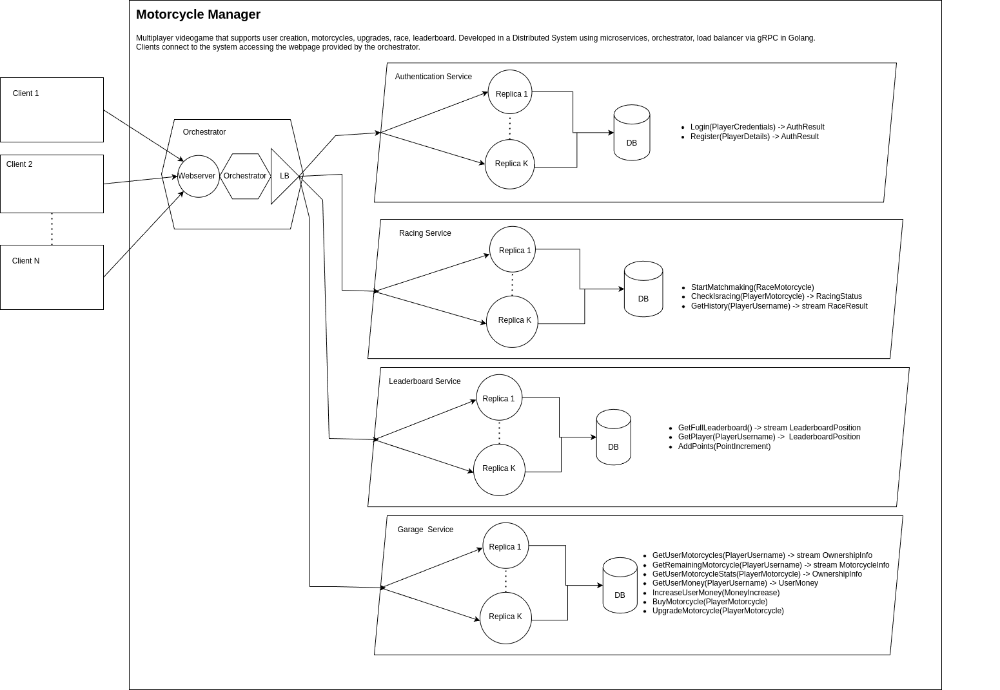

# ProgettoDP

## Description

Motorcycle Manager is an online game that allows the users to register in the system, buy and upgrade motorcycles, start a race and keep track of the wins in the history, and more importantly being the best driver in the leaderboard.

## Prerequisites

- docker

- docker compose

- make

## Steps to Run

- make update_proto (compile protobuf definitions)

- make build (build containers)

- make up (or make upd for detached version)

- make stop (to stop containers)

- make down (to stop containers and clean the system from volumes and networks)

### Users already inside the Database (username:password)

- Lorenzo:12345

- Matteo:abcde

## Steps for running Tests

- make update_proto (compile protobuf definitions)

- (make build_test already performed when using *make test*)

- make test

- make down_test (to stop containers and clean the system from volumes and networks)

## Steps for cleaning

- make clean

## Environment Variables

In the .env file it is possible to edit the environment variables (such as the number of replicas per service).